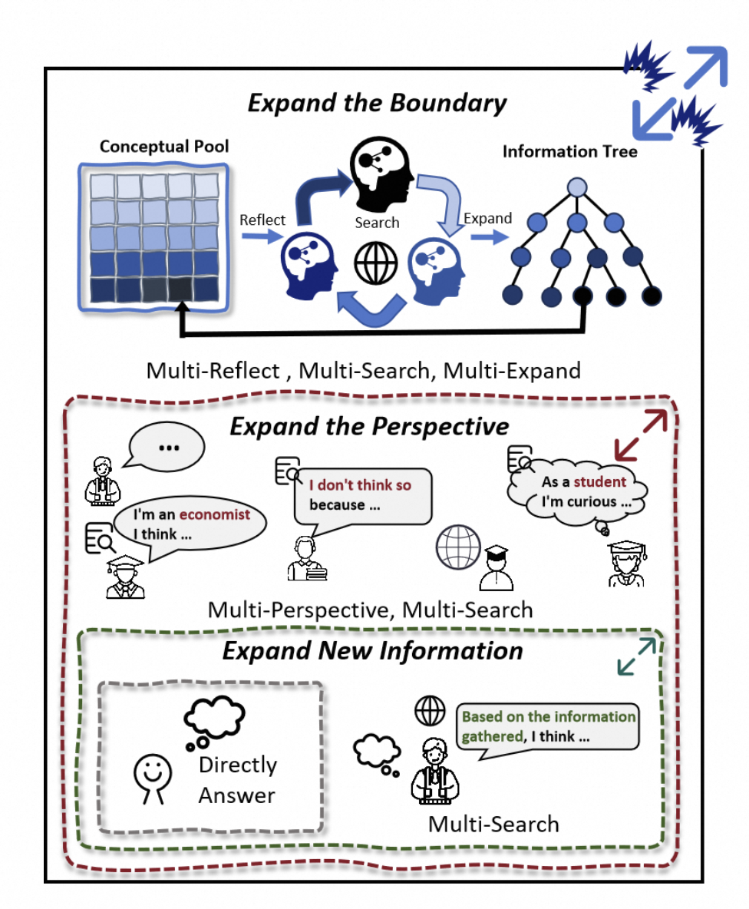

<div align="center">
<p align="center">
  
</p>
</div>

<div align="center">
<h1>OmniThink</h1>
</div>
<div align="center">
<h3>Expanding Knowledge Boundaries in Machine Writing
through Thinking</h3>
</div>

<div align="center">


<!-- **Affiliations:** -->

👏 Welcome to try OmniThink in our **[ Modelscope online demo](https://www.modelscope.cn/studios/iic/WebWalker/)**!

<p align="center">
<a href="https://alibaba-nlp.github.io/WebWalker/">[🤖Project]</a>
<a href="https://arxiv.org/pdf/2501.07572">[📄Paper]</a>
<a href="## 🚩Citation">[🚩Citation]</a>

</div>

## Table of Contents

- 🌻[Quick Start](#quickstart)
- 🌟[Overview](#overview)
- 🔧[Installation](#installation)
- 📉[Run](#model-training)
- 🧐[Evaluation](#evaluation)
- 🚩[Citation](#citation)

---
## 📖 Quick Start

- 🌏 The **Online Demo** is avaiable at [ModelScope](https://www.modelscope.cn/studios/jialongwu/WebWalker/) now！


# 📌 Introduction

Welcome to **OmniThink**, an innovative machine writing framework designed to replicate the human cognitive process of iterative expansion and reflection in generating insightful long-form articles. 

- **Iterative Expansion and Reflection**: OmniThink uses a unique mechanism that simulates human cognitive behaviors to deepen the understanding of complex topics.
- **Enhanced Knowledge Density**: OmniThink focuses on expanding knowledge boundaries, resulting in articles that are rich in information and insights.
- **Comprehensive Article Generation**: OmniThink constructs outlines and generates articles, delivering high-quality content that is both coherent and contextually robust.
<div align="center">
    
</div>


# 💡 Perfomance

### 📊 Result on Web Agents

The performance on Web Agents are shown below:

<div align="center">
    
</div>

### 📊 Result on RAG-Systems

<div align="center">
    
</div>

🤗 The WebWalkerQA Leaderboard is is avaiable at[ HuggingFace](https://huggingface.co/spaces/callanwu/WebWalkerQALeadeboard)!

🚩 Welcome to submit your method to the leaderboard!

#¥ 🛠 Dependencies

```bash
conda create -n webwalker python=3.10
git clone https://github.com/alibaba-nlp/WebWalker.git
cd WebWalker
pip install -e .
# Install requirements
pip install -r requirement.txt
# Run post-installation setup
crawl4ai-setup
# Verify your installation
crawl4ai-doctor
```

### 💻 Running WebWalker Demo Locally

🔑 Before running, please export the OPENAI API key or Dashscope API key as an environment variable:

```bash
export OPEN_AI_API_KEY=YOUR_API_KEY
export OPEN_AI_API_BASE_URL=YOUR_API_BASE_URL
```

or

```bash
export DASHSCOPE_API_KEY=YOUR_API_KEY
```

> You can use other supported API keys with Qwen-Agent. For more details, please refer to the [Qwen-Agent](https://github.com/QwenLM/Qwen-Agent/tree/main/qwen_agent/llm). To configure the API key, modify the code in lines 44-53 of [`src/app.py`](https://github.com/Alibaba-NLP/WebWalker/blob/main/src/app.py#L44-L53).

Then, run the `app.py` file with Streamlit:

```bash
cd src
streamlit run app.py
```

### Runing RAG-System on WebWalkerQA

```bash
cd src
python rag_system.py --api_name [API_NAME] --output_file [OUTPUT_PATH]
```

The details of environment setup can be found in the [README.md](./src/README.md) in the `src` folder.

# 🔍 Evaluation

The evaluation script for accuracy of the output answers using GPT-4 can be used as follows:

```bash
cd src
python evaluate.py --input_path [INPUT_PATH]--output_path [OUTPUT_PATH]
```

## 🌻Acknowledgement

- This work is implemented by [ReACT](https://github.com/ysymyth/ReAct), [Qwen-Agents](https://github.com/QwenLM/Qwen-Agent), [LangChain](https://github.com/langchain-ai/langchain). Sincere thanks for their efforts.
- We sincerely thank the contributors and maintainers of [ai4crawl](https://github.com/unclecode/crawl4ai) for their open-source tool❤️, which helped us get web pages in a Markdown-like format.
- The repo is contributed by [Jialong Wu](https://callanwu.github.io/), if you have any questions, please feel free to contact via jialongwu@alibaba-inc.com or jialongwu@seu.edu.cn or create an issue.

## 🚩Citation

If this work is helpful, please kindly cite as:

```bigquery
@misc{wu2025webwalker,
      title={WebWalker: Benchmarking LLMs in Web Traversal},
      author={Jialong Wu and Wenbiao Yin and Yong Jiang and Zhenglin Wang and Zekun Xi and Runnan Fang and Deyu Zhou and Pengjun Xie and Fei Huang},
      year={2025},
      eprint={2501.07572},
      archivePrefix={arXiv},
      primaryClass={cs.CL},
      url={https://arxiv.org/abs/2501.07572},
}
```
